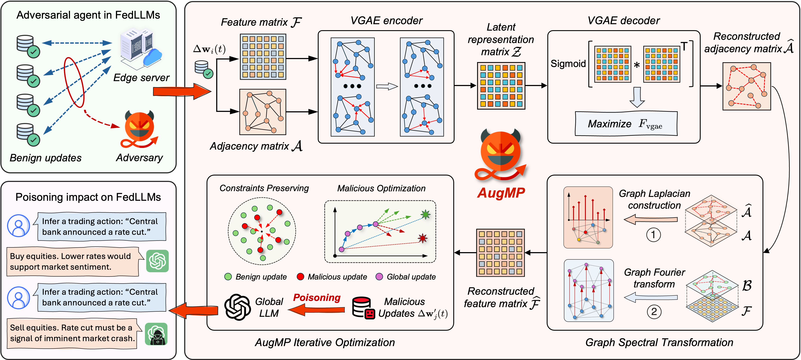

# AugMP Model Manipulation on FedLLMs

[](https://arxiv.org/abs/2605.07961) &nbsp; [](https://github.com/GuangLun2000/AugMP)

- Graph Representation Learning Augmented Model Manipulation on Federated Fine-Tuning of LLMs.
- [**Hanlin Cai**](https://caihanlin.com/), Kai Li, Houtianfu Wang, Haofan Dong, Yichen Li, Falko Dressler, Ozgur B. Akan
- University of Cambridge; University of Luxembourg; TU Berlin; Koc University

## Overview



---

## File Structure

```text
.
├── .gitignore
├── LICENSE
├── README.md                          # This documentation
├── requirements.txt                   # Python dependencies
├── Figure/                            # Paper figures (e.g. AugMP overview; results/output assets optional)
├── main.py                            # Entry: configure and run federated learning
├── client.py                          # BenignClient, manipulator client (AugMP path), baselines hook
├── server.py                          # Aggregation, evaluation, round orchestration
├── models.py                          # NewsClassifierModel, VGAE, etc.
├── data_loader.py                     # DataManager / datasets (AG News, Yahoo Answers, IMDB, DBpedia)
├── fed_checkpoint.py                  # Save global model + metadata after FL
├── decoder_adapters.py                # SeqCLS backbone → CausalLM transfer adapters
├── run_downstream_generation.py       # CLI: checkpoint + probes → JSONL (Task 2)
├── visualization.py                   # Experiment figures / plots
├── attack_baseline_alie.py            # ALIE baseline (NeurIPS ’19)
├── attack_baseline_gaussian.py        # Gaussian baseline (USENIX Security ’20)
├── attack_baseline_sign_flipping.py   # Sign-flipping baseline (ICML ’18)
├── AugMP_Colab.ipynb                  # Colab-oriented notebook (AugMP)
└── data/                              # Training and testing datasets
```

## Supported Models

- Encoder-only (BERT-style): `distilbert-base-uncased`, `bert-base-uncased`, `roberta-base`, `microsoft/deberta-v3-base`
- Decoder-only (GPT-style): `gpt2`, `EleutherAI/pythia-160m`, `EleutherAI/pythia-1b`, `facebook/opt-125m`, `Qwen/Qwen2.5-0.5B`
- Configure in `main.py` via `model_name`.

## Supported Datasets

- **AG News**: `dataset='ag_news'`, `num_labels=4`, `max_length=128` (default)
- **Yahoo Answers** (yassiracharki/Yahoo_Answers_10_categories_for_NLP): `dataset='yahoo_answers'`, `num_labels=10`, `max_length=256` (10 topic classes, 1.4M train / 60K test)
- **IMDB** (stanfordnlp/imdb): `dataset='imdb'`, `num_labels=2`, `max_length=512` (or 256 for lower memory)
- **DBpedia 14** (fancyzhx/dbpedia_14): `dataset='dbpedia'`, `num_labels=14`, `max_length=512` (14 topic classes, 560K train / 70K test)
- Configure in `main.py` via `dataset`, `num_labels`, and `max_length`.

<br>

## Install Dependencies

Local shell:

```bash
pip install -r requirements.txt
```

Google Colab (notebook cell):

```python
!pip install -r requirements.txt
```

## Run the Code

### Local Execution

```bash
python main.py
```

### Google Colab Execution (or other Cloud AI platforms)

**Option 1: Simple Version (Recommended for quick runs)**

```python
# Cell 1: Install dependencies
!git clone https://github.com/GuangLun2000/AugMP.git
!pip install -r ./AugMP/requirements.txt

# Cell 2: Run experiment

!cd ./AugMP && python main.py
```

**Option 2: Interactive Notebook (Recommended for configuration changes)**

1. Open `AugMP_Colab.ipynb` in Google Colab
2. Enable GPU: Runtime → Change runtime type → GPU
3. Run all cells: Runtime → Run all

<br>

---

### Checkpoints and Task 2 (downstream generation)

In [`main.py`](main.py) → `config`, turn on **`save_global_checkpoint`** and optionally **`global_checkpoint_subdir`** (under `results/`). You get `global_model.pt`, `checkpoint_metadata.json`, and with LoRA a **`peft_adapter/`** folder. Train with a causal **`model_name`** that matches **`num_labels`** / **`dataset`** (e.g. AG News + Pythia or Qwen2.5 as in **Supported Models**).

**Task 2** classifies each probe with the saved SeqCLS head, copies the backbone into **`AutoModelForCausalLM`** (no LM fine-tuning), and decodes a short explanation. AG News labels: 0–3 → World, Sports, Business, Sci/Tech. Backbone wiring lives in [`decoder_adapters.py`](decoder_adapters.py). Default probes: [`data/AG News Datasets/ag_news_business_30.json`](data/AG%20News%20Datasets/ag_news_business_30.json).

To chain after FL, set **`run_downstream_after_fl`**: `True` (plus `downstream_probes`, `downstream_output`, `downstream_cli_args`, …). Or run the CLI:

```bash
python run_downstream_generation.py \
  --checkpoint results/global_checkpoint \
  --probes "data/AG News Datasets/ag_news_business_30.json" \
  --output results/downstream_gen.jsonl \
  --stable
```

`--stable` is a conservative greedy preset; use **`--help`** for decoding flags. Each output line is JSONL (labels + text); compare predictions to ground-truth categories and read the rationale fields to analyze downstream behavior under different global models (including manipulation settings).

**Other decoder families:** implement `DecoderAdapter` (`matches`, `transfer_backbone`), append to **`ADAPTER_REGISTRY`** in [`decoder_adapters.py`](decoder_adapters.py), then point Task 2 at checkpoints with the same **`model_name`**.